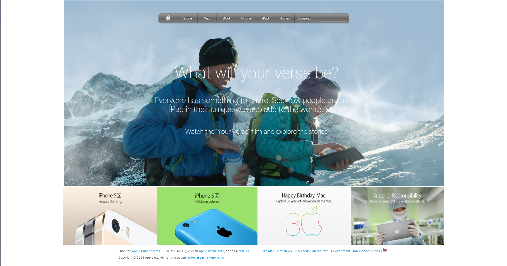

# Building with Backgrounds and Gradients - (Apple home page clone)

## [Solo Project]

This project consists of building a webpage using images as a background and adding gradients to elements. The goal is to make a clone of old an old version of the [Apple website webpage.](https://web.archive.org/web/20140301004610/http://www.apple.com/)

You can find the original project specification [here](https://www.theodinproject.com/courses/html5-and-css3/lessons/building-with-backgrounds-and-gradients)

|Clone Page|
|:---:|
||

## Tools Used

- HTML5
- MarkDown Syntax
- CSS3 & (layout property)

## Work Done

- [x] Lay out the basic structure of the page using empty semantic HTML elements that are appropriately sized and positioned.
- [x] Set up the top navigation bar.
- [x] Set up the main background image.
- [x] Use Semantic HTML.
- [x] Use Flex or grid in the project.
- [x] Fill in and position the additional sections.
- [x] Pass CSS stylelint test.
- [x] Check html with W3C validator.
- [x] Validate Readme file with markdown lint.

## How to Install and use

- clone the repository `git clone https://github.com/christianotieno/apple-home-page-clone.git`
- open command prompt in `apple-home-page-clone` folder
- run the application using open live server functionality.

LInk to live demo [here](https://christianotieno.github.io/apple-home-page-clone/.)

## Author's social links

- Github: [@christianotieno](https://github.com/christianotieno)
- Twitter: [@iamchrisotieno](https://twitter.com/iamchrisotieno)
- Linkedin: [Christian Otieno](https://www.linkedin.com/in/christianotieno/)
